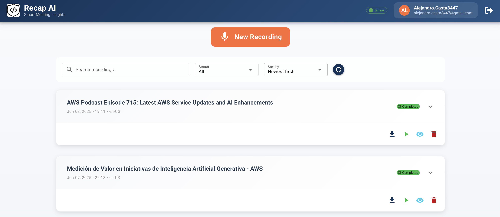
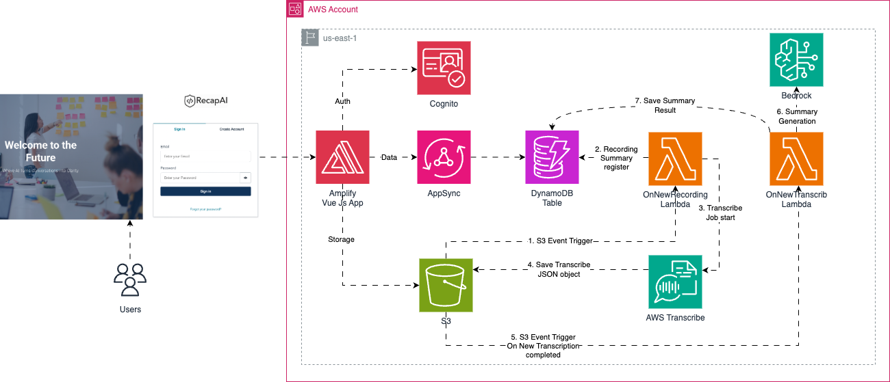

# 🎙️ RecapAI - AI-Powered Meeting Intelligence Platform

<div align="center">
  
</div>
<div align="center">
  
</div>
<div align="center">
  
</div>

Transform every meeting into instantly digestible, visual summaries with the power of serverless AI.

## 🌟 Project Vision

I realized that even though I have powerful AI tools at my fingertips, I still rely on manual note-taking or long recordings I never revisit. **What if I could transform every meeting into an instantly digestible, visual summary?**

RecapAI is a **truly serverless solution** that scales automatically based on demand, without the overhead of managing infrastructure, built specifically for the AWS Lambda Hackathon.

## 🚀 AWS Lambda - The Serverless Heart

AWS Lambda orchestrates the entire intelligent processing pipeline through specialized functions that work in perfect harmony:

## Infrastructure Diagram

<div align="center">
  
</div>

### 🔧 Core Lambda Functions

| Function                     | Purpose                                       | Trigger           |
| ---------------------------- | --------------------------------------------- | ----------------- |
| **🎵 Audio Processor**       | Pipeline initiator and audio validation       | S3 Object Created |
| **📝 Transcription Handler** | Processes AssemblyAI transcription completion | Lambda Invoke     |
| **🧠 AI Summarizer**         | Generates intelligent summaries using Bedrock | Lambda Invoke     |
| **📊 Diagram Generator**     | Creates Mermaid diagrams from AI insights     | Lambda Invoke     |
| **🔄 Status Updater**        | Real-time status updates to frontend          | DynamoDB Streams  |

### 🎯 Processing Pipeline

🎙️ **Audio Recording** ↓  
📤 **Upload to S3** ↓  
⚡ **Lambda: Audio Processor** (Triggered by S3 Event) ↓  
🎯 **AssemblyAI: Speech-to-Text** ↓  
📡 **Lambda: Transcription Handler** ↓  
🤖 **Amazon Bedrock: AI Processing** ↓  
⚡ **Lambda: AI Summarizer & Diagram Generator** ↓  
💾 **Results Stored in DynamoDB** ↓  
📱 **Real-time Updates to Frontend**

## 🛠️ Complete Tech Stack

### ☁️ AWS Services (Serverless-First)

- **AWS Lambda** (Core) - All processing logic and workflow orchestration
- **Amazon S3** - Audio files and processed content storage
- **AssemblyAI** - Professional-grade speech-to-text conversion with confidence scoring
- **Amazon Bedrock** - AI-powered intelligent summarization and diagram generation
- **Amazon DynamoDB** - NoSQL database for metadata and results with real-time streams
- **Amazon CloudWatch** - Comprehensive monitoring and alerting
- **Amazon Cognito** - Secure user authentication and management
- **AWS Amplify** - Frontend hosting, CI/CD pipeline, and backend capabilities

### 🖥️ Frontend Technology

- **Vue.js 3** - Modern reactive framework with Composition API
- **Quasar Framework** - Material Design components and responsive layouts
- **Pinia** - State management for user sessions and recording data
- **Vue Router** - Client-side routing and navigation
- **Axios** - HTTP client for API communication
- **Vue Markdown Render** - Markdown rendering for AI summaries
- **Vue Mermaid String** - Interactive diagram visualization

## ✨ Key Features

- 🎙️ **Browser-based Recording** - Record directly in the application with real-time feedback
- 📝 **AI Transcription** - Accurate speech-to-text with speaker detection and confidence scoring
- 🧠 **Intelligent Summaries** - Key points, action items, and insights generated by Bedrock
- 📊 **Visual Diagrams** - Auto-generated Mermaid flowcharts and mind maps
- 🔄 **Real-time Processing** - Live status updates during processing pipeline
- 💾 **Cloud Storage** - Secure, scalable file management with S3
- 📱 **Responsive Design** - Perfect experience on any device with Quasar
- 🔐 **Enterprise Security** - End-to-end encryption and Cognito authentication
- 🎯 **Multi-format Support** - mp3, webm, wav, m4a, ogg, flac audio formats

## 🚀 Quick Start

### Prerequisites

```bash
# Required tools
Node.js >= 20.0.0
AWS CLI configured
Quasar CLI
AssemblyAI API Key
```

### 📦 Installation

```bash
# Clone the repository
git clone https://github.com/4l3j4ndr0/recap-ai
cd recapai

# Install dependencies
npm install
```

### 🔧 Development Setup

```bash
# Execute the application locally
npm run dev
# Available at http://localhost:9000

# Execute the Amplify Sandbox environment
npm run amplify-sandbox

# In case of using AWS profile
npm run amplify-sandbox -- --profile <my-profile>
```

### 🔑 Environment Configuration

Set up your environment variables for AI services:
- AssemblyAI API Key for transcription
- AWS credentials for Bedrock access
- Amplify configuration for backend services

## 🎯 Use Cases

| Scenario | Benefit |
|----------|---------|
| 🏢 **Business Meetings** | Generate action items and key decisions automatically |
| 🎤 **Interviews** | Create structured summaries with insights and follow-ups |
| 📚 **Lectures** | Transform content into study materials with visual aids |
| 💡 **Brainstorming** | Visualize ideas with automatic mind maps and flowcharts |
| 🚀 **Team Standups** | Quick summaries of progress, blockers, and next steps |

## 🏆 Hackathon Achievement

[](https://awslambdahackathon.devpost.com/)

RecapAI showcases the power of serverless architecture in creating intelligent, scalable applications that solve real-world productivity challenges.

### Why Serverless?

- ✅ **Zero Infrastructure Management** - Focus on features, not servers
- ✅ **Automatic Scaling** - Handle any workload size seamlessly
- ✅ **Cost Efficiency** - Pay per execution, not idle time
- ✅ **High Availability** - Built-in redundancy and fault tolerance
- ✅ **Rapid Development** - Faster time to market with managed services
- ✅ **Event-Driven Architecture** - Real-time processing with S3 triggers and DynamoDB streams

## 🔧 Technical Architecture

### Data Flow
1. **Audio Upload** → S3 bucket with event notifications
2. **Lambda Trigger** → Validates format and initiates processing
3. **AssemblyAI Processing** → High-accuracy transcription with metadata
4. **Bedrock AI** → Generates summaries and Mermaid diagrams
5. **DynamoDB Storage** → Stores results with real-time updates
6. **Frontend Updates** → Live status tracking and result display

### Security & Compliance
- **Authentication** → Cognito user pools with secure sessions
- **Authorization** → Fine-grained access control per user
- **Data Encryption** → At rest and in transit
- **API Security** → Authenticated endpoints with rate limiting
