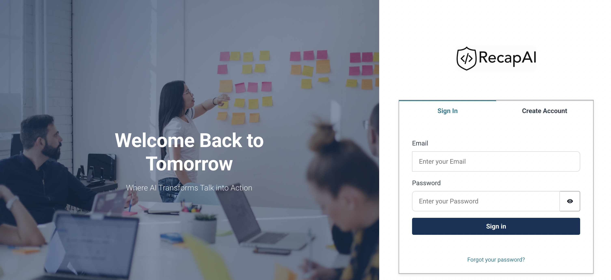
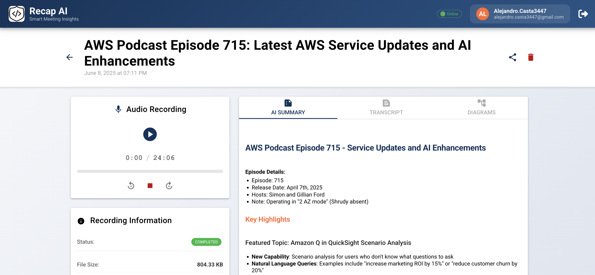

# 🎙️ RecapAI - AI-Powered Meeting Intelligence Platform

<div align="center">
  
</div>
<div align="center">
  
</div>

Transform every meeting into instantly digestible, visual summaries with the power of serverless AI.

## 🌟 Project Vision

We realized that while we have powerful AI tools at our disposal, most people still rely on manual note-taking or lengthy recordings they never revisit. **What if we could transform every meeting into an instantly digestible, visual summary?**

RecapAI is a **truly serverless solution** that scales automatically based on demand, without the overhead of managing infrastructure, built specifically for the AWS Lambda Hackathon.

## 🚀 AWS Lambda - The Serverless Heart

AWS Lambda orchestrates the entire intelligent processing pipeline through specialized functions that work in perfect harmony:

### 🔧 Core Lambda Functions

| Function                     | Purpose                                       | Trigger           |
| ---------------------------- | --------------------------------------------- | ----------------- |
| **🎵 Audio Processor**       | Pipeline initiator and audio validation       | S3 Object Created |
| **📝 Transcription Handler** | Processes AWS Transcribe completion events    | Lambda Invoke     |
| **🧠 AI Summarizer**         | Generates intelligent summaries using Bedrock | Lambda Invoke     |
| **📊 Diagram Generator**     | Creates Mermaid diagrams from AI insights     | Lambda Invoke     |
| **🔄 Status Updater**        | Real-time status updates to frontend          | Subscriptions     |

🎙️ Audio Recording ↓ 📤 Upload to S3 ↓ ⚡ Lambda: Audio Processor (Triggered by S3 Event) ↓ 🎯 AWS Transcribe Job Initiated ↓ 📡 EventBridge: Transcription Complete ↓ ⚡ Lambda: Transcription Handler ↓ 🤖 Amazon Bedrock: AI Processing ↓ ⚡ Lambda: AI Summarizer & Diagram Generator ↓ 💾 Results Stored in DynamoDB ↓ 📱 Real-time Updates to Frontend

## 🛠️ Complete Tech Stack

### ☁️ AWS Services (Serverless-First)

- **AWS Lambda** (Core) - All processing logic and workflow orchestration
- **Amazon S3** - Audio files and processed content storage
- **AWS Transcribe** - Professional-grade speech-to-text conversion
- **Amazon Bedrock** - AI-powered intelligent summarization
- **Amazon DynamoDB** - NoSQL database for metadata and results
- **Amazon CloudWatch** - Comprehensive monitoring and alerting
- **Amazon Cognito** - Secure user authentication and management
- **AWS Amplify** - Frontend hosting and CI/CD pipeline and backend capabilities.

### 🖥️ Frontend Technology

- **Vue.js 3** - Modern reactive framework
- **Quasar Framework** - Material Design components
- **Pinia** - State management
- **Vue Router** - Client-side routing
- **Axios** - HTTP client for API communication

## ✨ Key Features

- 🎙️ **Browser-based Recording** - Record directly in the application
- 📝 **AI Transcription** - Accurate speech-to-text with speaker detection
- 🧠 **Intelligent Summaries** - Key points, action items, and insights
- 📊 **Visual Diagrams** - Auto-generated flowcharts and mind maps
- 🔄 **Real-time Processing** - Live status updates during processing
- 💾 **Cloud Storage** - Secure, scalable file management
- 📱 **Responsive Design** - Perfect experience on any device
- 🔐 **Enterprise Security** - End-to-end encryption and authentication

## 🚀 Quick Start

### Prerequisites

```bash
# Required tools
Node.js >= 20.0.0
AWS CLI configured
Quasar CLI
```

### 📦 Installation

# Clone the repository

git clone https://github.com/4l3j4ndr0/recap-ai
cd recapai

# Install dependencies

```bash
npm install
```

### 🔧 Development Setup

```bash
# Execute the application in local
npm run dev
# Available at http://localhost:9000

# Execute the amplify Sandbox environment
npm run amplify-sandbox

# In case of use aws profile the command will be
npm run amplify-sandbox -- --profile <my-profile>
```

## 🎯 Use Cases

### Scenario Benefit

- 🏢 Business Meetings Generate action items and key decisions
- 🎤 Interviews Create structured summaries with insights
- 📚 Lectures Transform content into study materials
- 💡 Brainstorming Visualize ideas with automatic mind maps
- 🚀 Team Standups Quick summaries of progress and blockers

## 🏆 Hackathon Achievement

[](https://awslambdahackathon.devpost.com/)

RecapAI showcases the power of serverless architecture in creating intelligent, scalable applications that solve real-world productivity challenges.

### Why Serverless?

- ✅ Zero Infrastructure Management - Focus on features, not servers
- ✅ Automatic Scaling - Handle any workload size
- ✅ Cost Efficiency - Pay per execution, not idle time
- ✅ High Availability - Built-in redundancy and fault tolerance
- ✅ Rapid Development - Faster time to market
